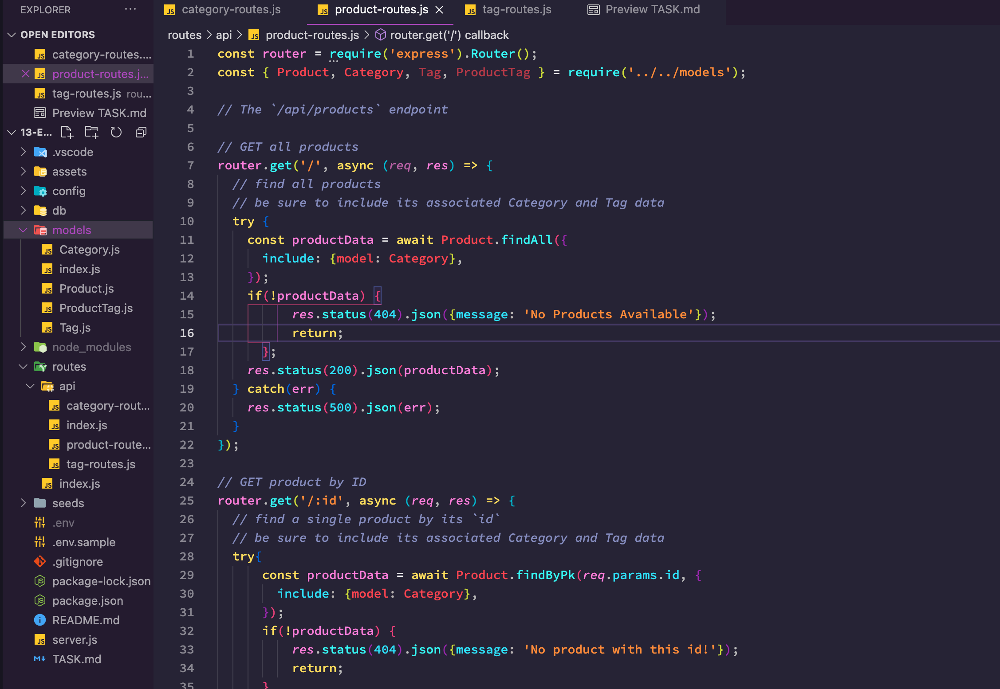

# eCommerce Backend

========================

## Description
Creating a backend for an eCommerce site using Express.js and Sequelize.

## Table of Contents
* [`Installation`](#Installation)
* [`Usage`](#Usage-Information)
* [`License`](#License)
* [`Contribution Guidelines`](#Contribution-Guidelines)
* [`Test Instructions`](#Test-Instructions)
* [`Contact`](#Contact-Information)

## Installation
To install this project, do the following:

Download or Clone the Repo
Type npm install in the root
Add your mysql creds to the .env.sample file and rename it to .env
Run npm start
Use your favorite API explorer to hit the api points

## Usage Information
To use this project, do the following:
None

## Contribution Guidelines
> None

## Test Instructions
To test this project, do the following:
> None

## License Information

## Contact Information
> [`Email Me`](olsenj.andrew@gmail.com)

> You can find more of my work at:
> [`Github`](https://github.com/drewole)

